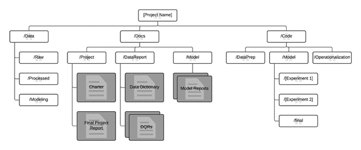
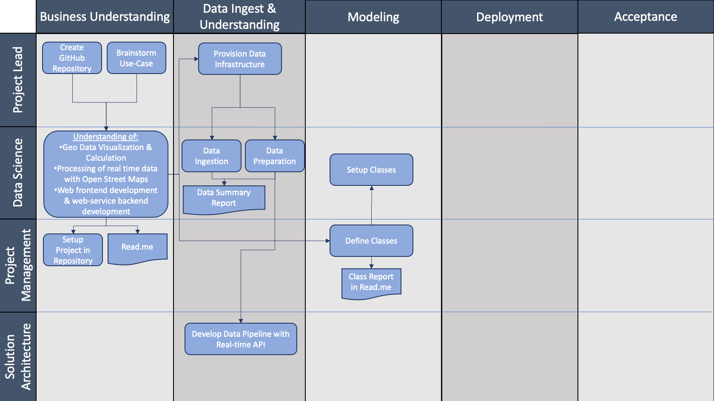
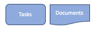

- Alicia Hamann [741182]
- Karina Hasler [738211]
- Gabriel Sacher [862446]

# 001 - Earthquake Detector
### *Realtime detection and visualization of earthquake occurrences in predefined region (map segment) over a certain time.*

## 1. Goals

- What was the task to be accomplished?
  - Realtime detection and visualization of earthquake occurrences within the last 24 hours in predefined region

- What was intended to achieve?
  - Provide an intuitive and user-friendly tool for the visualization of earthquakes all over the world
  

## 2. Description:

Description and your understanding of the business question or problem, analytical question and/or technical problem associated with the use case.

- #### What are the challenges that need to be mastered?
1. Processing of real-time data 
2. Geo data calculations and visualization with OpenStreetMaps
3. Web frontend development & Web-service backend development
4. Searchbar for different user defined configurations 
    
- #### 1. Processing of real-time data
  - Find suitable database with detailed, consistent & real-time earthquake data for the entire world
  - Set up an API for the automatic download of data
  - Data preparation : extract relevant data & transform it into a usable structure
  
- #### 2. Geo data calculations and visualization with OpenStreetMaps
  - Visualize the earthquakes on a map 
      - Adapt circle radius and color depending on the magnitude
      - Show the current location on a map
      - Popup with timestamp, magnitude and distance
  - Calculate the distance from current location to selected earthquake
  
- #### 3. Web frontend development & web-service backend development
  - Starts a web server, opens a web page in the default browser that provides the following features:
    
        - A nice logo and layout. Use the HSD logo or create your own. 
        - A Google-like search field at the top with a search button to update the visualization. The field should be prefilled with the current location. Pressing the search button will read the location from the search field and refresh the page.
        - Below the search field a screen-filling map is shown with the selected location in the center, and a zoom-in factor appropriate to cover a circle with actual search radius.
        - On overlay that draws the location of all earthquakes of the last 24 hours into the actual map, represented by a circle contains the strength (Richter scala) of the earth quake and a label with the timestamp of the earth quake.
          the web page should be update evers
  
- #### 4. Searchbar for different user defined configurations 
  - Three arguments for configuration: 
  
        - A location either as an address or a city, region or country name or longitude and latitude positioning (default value: Current location of the computer)
        - A radius for the radius around the location in kilometers (default value: 250km)
        - An update frequency in seconds (default 30 sec)
    
  - Samples for valid calls:

        - quakemonitor.py
        - quakemonitor.py --location "Paris"
        - quakemonitor.py --location "Silicon Valley" --radius 500  
        - quakemonitor.py --location "Düsseldorf" --radius 100 --update 10
        - quakemonitor.py --long 51.246839 --lat 6.7916647 --radius 100

## 3. Methodological approach

The methodological approach chosen to process and implement the use case.
For analytical uses cases it is wise to follow a structured approach like Microsoft's Team Database Science Process (TDSP), which is the legitimate successor of the CrispDM methodology.
___
###Key Components of the TDSP:
1. **Data Science lifecycle definition**
    - Business Understanding
    - Data Acquisition and Understanding (Data Source, Pipeline, Exploration and Cleaning)
    - Modeling (Feature Engineering: Feature selection, Transforming and Binding)
    - Deployment (Performance, Monitoring)
2. **Standardized project structure**
    - Template for folder structure 
   
3. **Infrastructure  and resources recommended for the project**
4. **Tools and utilities recommended for project execution**
___

## 4. Details

*Most important*

A detailed description of your:

**- Approach:**
   
  
    

**- Work:**
  1. Processing of real-time data 
  2. Geo data calculations and visualization with OpenStreetMaps
  3. Web frontend development & Web-service backend development
  4. Searchbar for different user defined configurations 
- findings
- concrete achievements

Here you should accumulate the largest part of your writing.

## 5. Summary 
A summary if the targets have been achieved, and if not - and whatever the reason is - why it wasn't achieved.
