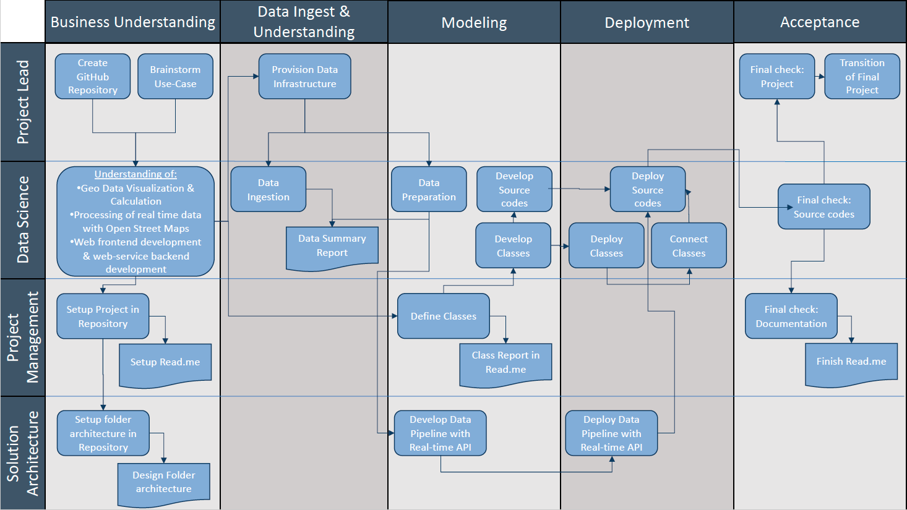

- Alicia Hamann [741182]
- Karina Hasler [738211]
- Gabriel Sacher [862446]
___

# 001 - Earthquake Detector
### *Realtime detection and visualization of earthquake occurrences in predefined region (map segment) over a certain time.*

## 1. Goals

- What was the task to be accomplished?
  - Realtime detection and visualization of earthquake occurrences within the last 24 hours in predefined region

- What was intended to achieve?
  - Provide an intuitive and user-friendly tool for the visualization of earthquakes all over the world
  

## 2. Description:

Description and your understanding of the business question or problem, analytical question and/or technical problem associated with the use case.

- #### What are the challenges that need to be mastered?
1. Processing of real-time data 
2. Geo data calculations and visualization with OpenStreetMaps
3. Web frontend development & Web-service backend development
4. Searchbar for different user defined configurations 
    
- #### 1. Processing of real-time data
  - Find suitable database with detailed, consistent & real-time earthquake data for the entire world
  - Set up an API for the automatic download of data
  - Data preparation : extract relevant data & transform it into a usable structure
  
- #### 2. Geo data calculations
  - Calculate the distance from current location to selected earthquake
  
- #### 3. Geo data visualization with OpenStreetMaps
  - Visualize the earthquakes on a map
      
        - Adapt circle radius and color depending on the magnitude
        - Show the current location on a map
        - Popup with timestamp, magnitude and distance

- #### 4. Web frontend development & web-service backend development
  - Starts a web server, opens a web page in the default browser that provides the following features:
    
        - A nice logo and layout. Use the HSD logo or create your own. 
        - A Google-like search field at the top with a search button to update the visualization. The field should be prefilled with the current location. Pressing the search button will read the location from the search field and refresh the page.
        - Below the search field a screen-filling map is shown with the selected location in the center, and a zoom-in factor appropriate to cover a circle with actual search radius.
        - On overlay that draws the location of all earthquakes of the last 24 hours into the actual map, represented by a circle contains the strength (Richter scala) of the earth quake and a label with the timestamp of the earth quake.
          the web page should be update evers
  
- #### 5. Searchbar for different user defined configurations 
  - Three arguments for configuration: 
  
        - A location either as an address or a city, region or country name or longitude and latitude positioning (default value: Current location of the computer)
        - A radius for the radius around the location in kilometers (default value: 250km)
        - An update frequency in seconds (default 30 sec)
    
  - Samples for valid calls:

        - quakemonitor.py
        - quakemonitor.py --location "Paris"
        - quakemonitor.py --location "Silicon Valley" --radius 500  
        - quakemonitor.py --location "Düsseldorf" --radius 100 --update 10
        - quakemonitor.py --long 51.246839 --lat 6.7916647 --radius 100
___

## 3. Methodological approach

The methodological approach chosen to process and implement the use case.
For analytical uses cases it is wise to follow a structured approach like Microsoft's Team Database Science Process (TDSP), which is the legitimate successor of the CrispDM methodology.
Team Data Science Process (TDSP) is an agile, iterative, data science methodology to improve collaboration and team learning. It is supported through a lifecycle definition, standard project structure, artifact templates, and tools for productive data science.

#### Key Components of the TDSP:
1. **Data Science lifecycle definition**
    - Business Understanding
    - Data Acquisition and Understanding (Data Source, Pipeline, Exploration and Cleaning)
    - Modeling (Feature Engineering: Feature selection, Transforming and Binding)
    - Deployment (Performance, Monitoring)
2. **Standardized project structure**
    - Template for folder structure 
   
      - This is the general project directory structure for Team Data Science Process developed by Microsoft. 
      - It also contains templates for various documents that are recommended as part of executing a data science project when using TDSP.
3. **Infrastructure  and resources recommended for the project**
4. **Tools and utilities recommended for project execution**
___

## 4. Details

*Most important*

A detailed description of your:

### Approach:
As we mentioned earlier, we followed the Team Database Science Process (TDSP). 
Therefore we created a project management board to ensure a structured approach 
to process and implement our Earthquake-Monitor project:

### Work:
  **1. Processing of real-time data** 
- In order to develop a real-time updating map, we needed to included an API from the United States 
       Geological Surves (USGS) website.
- The API delivers our data, which contains all Earthquakes all over the world which took place in the last 24 hours.  
  
    > If you want to get further information about the USGS, click here:
        https://www.usgs.gov/
  > 
  > If you want to take a look at the data of the API, click here: 
        https://earthquake.usgs.gov/earthquakes/feed/v1.0/summary/all_day.geojson
- Data Preparation:
  
    For Data Preparation, we extract relevant data from the USGS API & transform it into a usable structure.
    The relevant data contains different features,which are represented in the table below:
  
    | Earthquake ID |  Longitude  | Latitude | Time | Magnitude |   
    | ---:| ---: | ---: | ---: | ---:
    | 00811746 | -119.4843 | 38.5368,1 | 1625824908214 | 2,0
    | ... | ... | ... | ... | ...

  **2. Geo data calculations**
  
- With the help of the location (longitude & latitude) of each earthquake and the current or inserted location from the user,
    we were able to append some geo data calculations:
  > ***Filter radius:***
  > With this method, we can only show earthquaked wich are in the given/inserted radius of the user. 
  > If the user does not filter by the radius, we set a default value of ???
  > 
  > ***Distance:***
  > With this method, we can calculate the distance between the given location of the user and each earthquake in kilometer
  >
  > ***Number of earthquakes:***
  > With this method, we can count the number of earthquakes in the given radius and represent the amount of earthquakes on our website
  > 
  > ***Closest Earthquake***
  > Whit this method, we can represent the closed earthquake to the user on our website.

  **3. Geo data visualization with OpenStreetMaps**
- We created a map with the folium package, to visualize the earthquakes and someother cool features and add-ons.
    > 
    > ***Earthquake Overlay:***
    > - This overlay adds the earthquakes from the API to the folium map and represents them though circles in different sizes and colours, depending on the magnitude of each earthquake.
    > - It sets a marker to the current location of the user as default or to the inserted location of the user.
    > - It also draws a line from the current location to the earthquakes in the radius, to make it  user friendlier to find the nearest earthquakes.
    > - If the user hovers over a earthquake, some detailled information about the earthquake, like timestamp, magnitude and distance pop up.
  > 
    > ***Tectonic Overlay:***
    > - This overlay adds the tectonic plates to the map. The user can enable or disable the tectonic plates by ticking or unticking the box in the layer control on the top right of the map.
  

  **4. Web frontend development & Web-service backend development**
- To setup a interactive and intuitive website, we used the flask package.

  **5. Searchbar for different user defined configurations** 
- In Order to make our website even more interactive and andvanced, we included inputfields.
> **Location:**
> Text
> 
> **Radius**
> Text

### Class Definition**

  **1. App**
- Text

  **2. Monitor**
- Text

  **3. DataCollector**
- Text

 **4. Earthquake**
- Text

  **5. Map**
- Text

  **6. Overlay**
- Text

___
## 5. Summary 
A summary if the targets have been achieved, and if not - and whatever the reason is - why it wasn't achieved.
- findings
- concrete achievements
___ 
## 6. Future Development
What are the next steps that could be done in order to keep process in the project.
