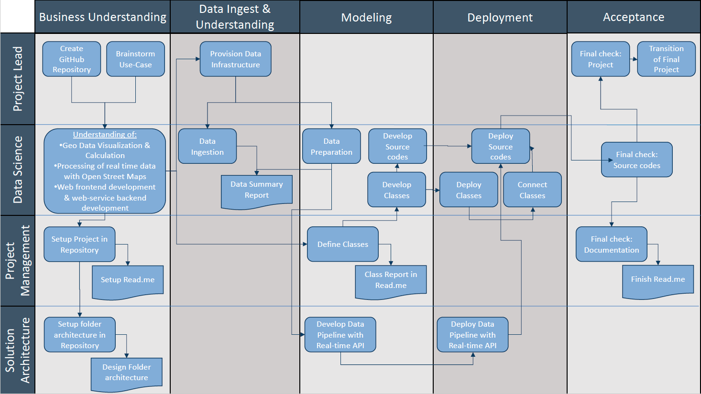
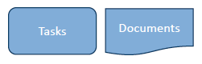
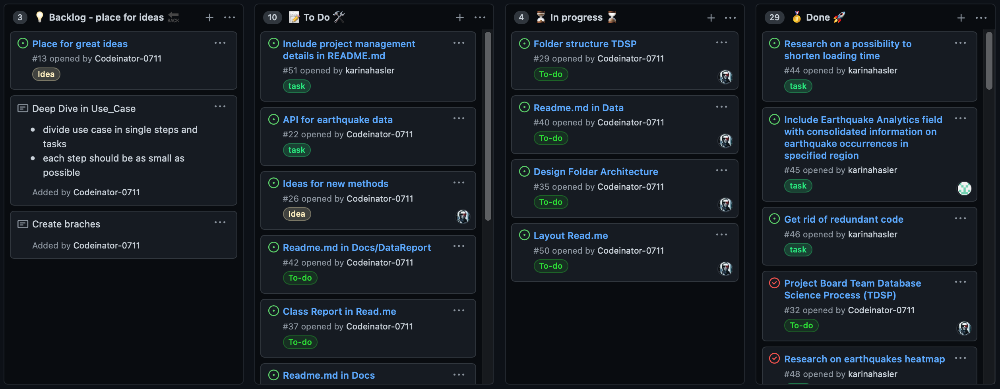
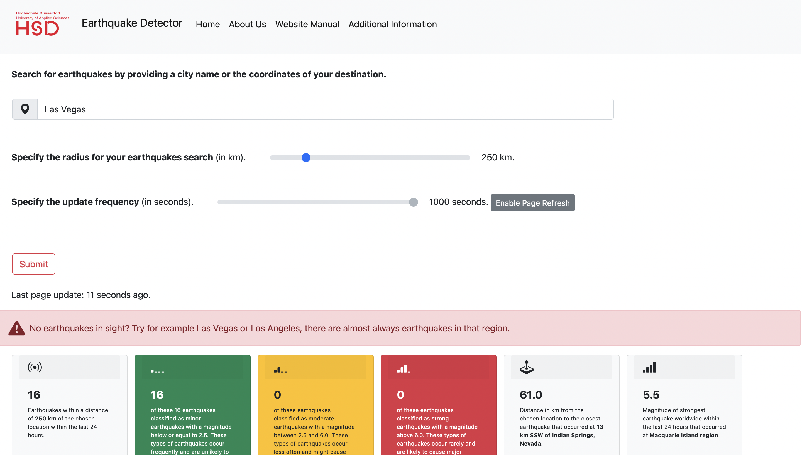
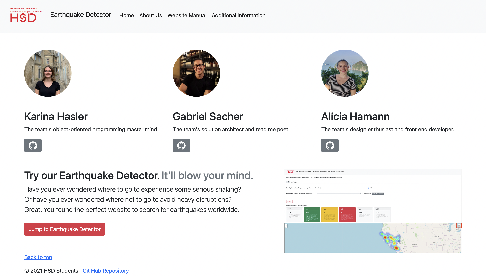
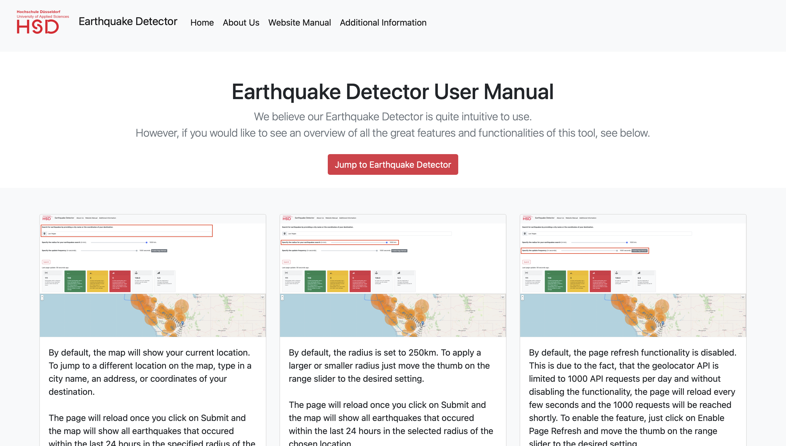
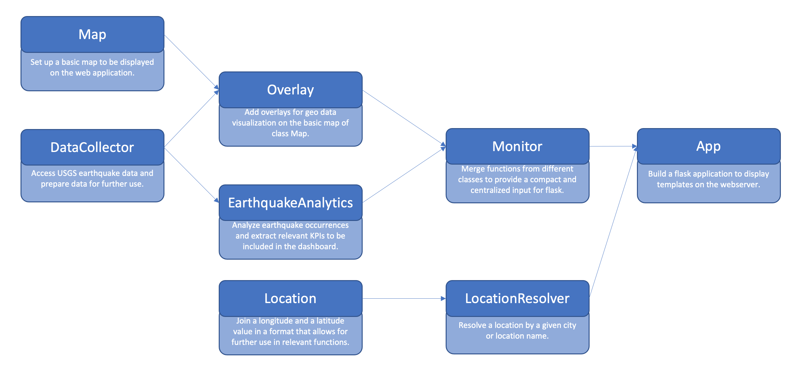

- Alicia Hamann [741182]
- Karina Hasler [738211]
- Gabriel Sacher [862446]
- Thomas Zeutschler 
___
# 001 - Earthquake Detector
### *Realtime detection and visualization of earthquake occurrences in predefined region (map segment) over a certain time.*
___
# Table of content
- [1. Goals](#1-goals)
- [2. Description](#2-description)
  * [2.1. Processing of real-time data](#21-processing-of-real-time-data)
  * [2.2 Geo data calculations](#22-geo-data-calculations)
  * [2.3 Geo data visualization with OpenStreetMaps](#23-geo-data-visualization-with-openstreetmaps)
  * [2.4 Web frontend development & web-service backend development](#24-web-frontend-development---web-service-backend-development)
  * [2.5 Searchbar for different user defined configurations](#25-searchbar-for-different-user-defined-configurations)
- [3. Methodological approach - Teams Data Science Process](#3-methodological-approach---teams-data-science-process)
- [4. Details of the approach](#4-details-of-the-approach)
- [5. Details of the work](#5-details-of-the-work)
  * [5.1 Processing of real-time data](#51-processing-of-real-time-data)
  * [5.2 Geo data calculations](#52-geo-data-calculations)
  * [5.3 Geo data visualization with OpenStreetMaps](#53-geo-data-visualization-with-openstreetmaps)
  * [5.4 Web frontend development & Web-service backend development](#54-web-frontend-development---web-service-backend-development)
  * [5.5 Searchbar for different user defined configurations](#55-searchbar-for-different-user-defined-configurations)
- [6. Class Definition](#6-class-definition)
  * [6.1 DataCollector](#61-datacollector)
  * [6.2 Map](#62-map)
  * [6.3 Overlay](#63-overlay)
  * [6.4 EarthquakeAnalytics](#64-earthquakeanalytics)
  * [6.5 Location](#65-location)
  * [6.6 LocationResolver](#66-locationresolver)
  * [6.7 Monitor](#67-monitor)
  * [6.8 App](#68-app)
  * [6.9 Class Architecture](#69-class-architecture)
- [7. Summary](#7-summary)
  * [7.1 Achievements](#71-achievements)
    + [7.1.1 Required achievements](#711-required-achievements)
    + [7.1.2 Additional achievements](#712-additional-achievements)
  * [7.2 Findings](#72-findings)
- [8. Future Development](#8-future-development)
  * [8.1 Forecast](#81-forecast)
  * [8.2 Create mobile app](#82-create-mobile-app)
  * [8.3 Dashboard upgrade](#83-dashboard-upgrade)
___

## 1. Goals

- **What was the task to be accomplished?**
  - Realtime detection and visualization of earthquake occurrences within the last 24 hours in predefined region

- **What was intended to achieve?**
  - Provide an intuitive and user-friendly tool for the visualization of earthquakes all over the world
  
## 2. Description

In the following, we are going to describe our understanding of the business question or problem, analytical question and/or technical problem associated with the use case.

**What are the challenges that need to be mastered?**

- ### 2.1. Processing of real-time data
  - Find suitable database with detailed, consistent & real-time earthquake data for the entire world
  - Set up an API for the automatic data download
  - Data preparation : Extract relevant data & transform it into a usable structure
  
- ### 2.2 Geo data calculations
  - Calculate the distance from current location to respective earthquake
  
- ### 2.3 Geo data visualization with OpenStreetMaps
  - Visualize the earthquakes on a map
      
        - Adapt circle radius and color depending on the magnitude
        - Show the current location on a map
        - Popup with timestamp and magnitude

- ### 2.4 Web frontend development & web-service backend development
  - Start a web server and open a web page in the default browser that provides the following features:
    
        - A nice logo and layout. Use the HSD logo or create your own. 
        - A Google-like search field at the top with a search button to update the visualization. The field should be prefilled with the current location. Pressing the search button will read the location from the search field and refresh the page.
        - Below the search field a screen-filling map is shown with the selected location in the center, and a zoom-in factor appropriate to cover a circle with actual search radius.
        - On overlay that draws the location of all earthquakes of the last 24 hours into the actual map, represented by a circle containing the strength (Richter scala) of the earthquake and a label with the timestamp of the earthquake.
        - The web page should be updated in a defined interval.
  
- ### 2.5 Searchbar for different user defined configurations 
  - Three arguments for configuration:

        - A location either as an address or a city, region or country name or longitude and latitude positioning (default value: Current location of the computer)
        - A numerical value for the radius around the location in kilometers (default value: 250km)
        - An update frequency in seconds (default 30 seconds)
    
  - Samples for valid calls:

        - quakemonitor.py
        - quakemonitor.py --location "Paris"
        - quakemonitor.py --location "Silicon Valley" --radius 500  
        - quakemonitor.py --location "Düsseldorf" --radius 100 --update 10
        - quakemonitor.py --long 51.246839 --lat 6.7916647 --radius 100
___

## 3. Methodological approach - Teams Data Science Process

A methodological approach is chosen to process and implement the use case.
For analytical use cases it is wise to follow a structured approach like Microsoft's Team Database Science Process (TDSP), which is the legitimate successor of the CRISP-DM methodology.
Team Data Science Process (TDSP) is an agile and iterative data science methodology to improve collaboration and team learning. It is supported through a lifecycle definition, standard project structure, artifact templates, and tools for productive data science.

**Key Components of the TDSP:**
1. **Data Science lifecycle definition**
    - Business Understanding
    - Data Acquisition and Understanding (Data Source, Pipeline, Exploration and Cleaning)
    - Modeling (Feature Engineering: Feature selection, Transforming and Binding)
    - Deployment (Performance, Monitoring)
2. **Standardized project structure**
    - Template for folder structure
    - This is the general project directory structure for Team Data Science Process developed by Microsoft. 
    - It also contains templates for various documents that are recommended as part of executing a data science project when using TDSP.

    

 
3. **Infrastructure  and resources recommended for the project**

TDSP provides recommendations for managing shared analytics and storage infrastructure such as:
   - Cloud file systems for storing datasets
   - Databases
   - Big data (SQL or Spark) clusters
   - Machine learning service

The storage infrastructure, where raw and processed datasets are stored, may be in the cloud or on-premise.This infrastructure enables reproducible analysis. It also avoids duplication, which may lead to inconsistencies and unnecessary infrastructure costs. Tools are in place to provide the shared resources, track them, and allow each team member to connect to those resources securely. It is also a good practice to have project members create a consistent compute environment. Different team members can then replicate and validate experiments.

4. **Tools and utilities recommended for project execution**

Introducing processes is challenging in most organizations. Tools to implement the data science process and lifecycle help lower the barriers to and increase the consistency of their adoption. TDSP provides an initial set of tools and scripts to jump-start adoption of TDSP within a team. It also helps to automate common tasks in the data science lifecycle such as data exploration and baseline modeling. There is a well-defined structure provided for individuals to contribute shared tools and utilities into their team's shared code repository. These resources can then be leveraged by other projects within the team or the organization.
___

## 4. Details of the approach

As we mentioned before, we followed the Team Database Science Process (TDSP). 
Therefore, we created a project management board to ensure a structured approach 
to process and implement our Earthquake-Detector project:

To ensure overall success of our project, we set up a kanban board in our GitHub repository and created a new issue for 
every task to be fulfilled in the working process. This allowed us to keep track of the to-dos, the work in progress and 
tasks we had already achieved. Additionally, we created a backlog category called "place for ideas". We discussed the 
suggestions and brainstorming ideas included in this category in our weekly meetings and decided as a team, if the idea 
becomes a to-do or not. The structure of our kanban board looked as follows:

## 5. Details of the work
### 5.1 Processing of real-time data
- In order to develop a real-time earthquake map, we needed to integrate an API from the United States 
       Geological Survey (USGS) website.
- The API delivers our data, which contains all earthquakes from all over the world that occurred within the last 24 hours. 
  The USGS website offers many configuration options concerning time period (in our case 24 hours) and magnitude (in our case all earthquakes regardless of magnitude). 
  These configurations can easily be changed if desired.
  
    > If you want to get further information about the USGS, click here:
        https://www.usgs.gov/
  > 
  > If you want to take a look at the data of the API, click here: 
        https://earthquake.usgs.gov/earthquakes/feed/v1.0/summary/all_day.geojson
- Data Preparation:
  
    For Data Preparation, we extract the relevant data from the USGS API and transform it into a usable structure.
    The relevant data per earthquake contains different features, which are represented in the table below:
  
    | Earthquake ID |  Longitude  | Latitude | Place | Time | Magnitude |   
    | ---:| ---: | ---: | ---: | ---: | ---:
    | 00811746 | -119.4843 | 38.5368,1 | Macquarie Island region | 1625824908214 | 2,0
    | ... | ... | ... | ... | ... | ...

### 5.2 Geo data calculations
  
- With the help of the location (longitude & latitude) of each earthquake and the current or inserted location from the user,
    we were able to append some geo data calculations:
  > ***Filter radius:***
  > With this method, we can filter earthquakes that occurred within the user specified radius. 
  > If the user does not enter a different radius, we set a default value of 250 km.
  > 
  > ***Distance:***
  > With this method, we can calculate the distance between the user specified location and each earthquake in kilometer.
  >
  > ***Number of earthquakes:***
  > With this method, we can count the number of earthquakes in the given radius and display the amount of earthquakes on our website.
  > 
  > ***Closest Earthquake***
  > With this method, we can report the closest earthquake to the user specified location on our website.

### 5.3 Geo data visualization with OpenStreetMaps
- We created a map with the folium package to visualize the earthquakes and to implement some other cool features and add-ons.
    > 
    > ***Earthquake Overlay:***
    > - This overlay adds the earthquakes from the API to the folium map and depicts them through circles in different sizes and colors, depending on the magnitude of the respective earthquake.
    > - It sets a marker to the current location of the user per default or according to the user specified location.
    > - It is also possible to insert lines from the current location to the earthquakes making it easier for the user to find the nearest earthquake. By clicking on the line, the user sees a popup with the distance between the chosen location and the respective earthquake in km.
    > - If the user hovers over an earthquake, additional information about the earthquake (timestamp and magnitude) appear.

    >
    > ***Tectonic Overlay:***
    > - This overlay adds the tectonic plates to the map. The user can enable or disable the tectonic plates by ticking or unticking the box in the layer control in the top right corner of the map.
  
### 5.4 Web frontend development & Web-service backend development
- To set up an interactive and intuitive website, we used the flask package. See 6.8 for details on how flask works.
- In total, our website consists of the following three html pages:
1. Home - index.html
2. About Us - about_us.html
3. Website Manual - manual.html

    
    > 
    > ***1. Index.html***
    > - The index.html file represents our home page and is the core part of our website.
    > - On this page, the earthquake detector is located with all its features.
    > - A dashboard shows some interesting statistics relating to the user's search, such as how many earthquakes occurred in that region, what was their magnitude, where was the closest earthquake and what magnitude had the strongest earthquake worldwide. 
    > - Also, the map showing the earthquakes within the specified radius of the chosen location is integrated on the bottom of this page.
    >
   
    > **Challenge:**
    > - We had some issues to integrate the map into our website as a new map html file is generated every time the code runs. We hence had to find a solution that allows for the integrated file to be dynamic.
    > 
   
    > **Tips & Tricks:**
    > - We solved the above-mentioned issue by using an iframe to integrate the map html file. In general, iframes are used to display content from another source, such as videos or advertisements via hyperlink or html reference in our case.
  
    
    >
    > ***2. about_us.html***
    > - The about_us.html file represents our about us page that can be reached via our navigation bar.
    > - On this page, the team is introduced as well as their responsibilities within the project.
    > - For each team member, the respective GitHub account is linked.
    > - By clicking on the button "Jump to Earthquake Detector" the user is redirected to the home page.   
    >
   
    > **Challenge:**
    > - We wanted a nice looking layout without spending too much time on it.
    > 
   
    > **Tips & Tricks:**
    > - The internet is full of great open source html templates for all kind of purposes. Especially for common sites such as about us pages there are numerous creative templates available. 
    > - We recommend to use bootstrap for building html website content. Bootstrap offers example code for all kinds of content elements and is relatively easy to implement and to work with.
    > - Check out https://getbootstrap.com/docs/5.1/getting-started/introduction/ 

    
    >
    > ***3. manual.html***
    > - The manual.html file represents our website user manual that can be reached via our navigation bar.
    > - On this page, we explain the main features of the earthquake detector and how it is intended to be used.
    > - Screenshots are used for reference.
    >
   
    > **Challenge:**
    > - We wanted the boxes (in bootstrap called cards) to be of the same seize in terms of width and height despite the different text lengths.
    > 
   
    > **Tips & Tricks:**
    > - Bootstrap makes layouting in html quite easy as it doesn't require you to create a separate css stylesheet. 
    > - Style attributes are added right into the class description.
    > - For the cards to have the same size, you have to add "d-flex" and "flex-column" to the class card-body -> class="card-body d-flex flex-column".

### 5.5 Searchbar for different user defined configurations
- In order to make our website even more interactive and advanced, we also included input fields that determine the search parameter.
    > **Location:**
    > - Default: Current location based on user's IP address
    > - Input: City name, coordinates, or specific address
    > - Output: Map zooms in to chosen location and shows earthquakes that occurred within the last 24 hours within the specified radius. 
    
    > **Radius**
    > - Default: 250 km
    > - Input: Value from range (min: 100; max:1000; step:50)
    > - Output: Map shows earthquakes that occurred within the last 24 hours within this radius of the chosen location.
    
    > **Update Frequency**
    > - Default: 1000 seconds (In task 30 seconds were stated. However, this did not make sense in our specific case as the USGS data is only updated every 60 seconds. Additionally, we felt that it is quite annoying if the page refreshes every 30 seconds which is why we decided for a default value of 1000 sec -> 16.6 min.)
    > - Input: Value from range (min: 10; max:1000; step:10)
    > - Output: Page reloads automatically after the defined time has passed. By default, the page refresh is disabled and can manually be enabled by the user.

## 6. Class Definition

### 6.1 DataCollector
- **Purpose**: Access USGS earthquake data and prepare data for further use.
- **Requirements**:
    - *datetime*: Process earthquake timestamp.
    - *geopy.distance*: Calculate distance between the user’s location and the individual earthquakes.
    - *requests*: Set up API to access USGS earthquake data of the last 24 hours (all earthquakes regardless of magnitude. This presetting can effortlessly be changed by selecting another GeoJSON summary format at the USGS website: https://earthquake.usgs.gov/earthquakes/feed/v1.0/geojson.php).
    - *geocoder*: Access the user’s current location.
- **Functions**:

| Function | Input parameters | Description | Return |
| ---------------|----------------|---------------|----------------|
| __init__ | **lat** (default = 0), **long** (default = 0) | Uses the user’s current location if no values for longitude and latitude are provided for further data preparation. | - |
| load_data | - | Accesses USGS earthquake data and transfers response to *earthquakes* variable. | - |
| prep_data | - | Loads data with *load_data* function. Extracts relevant earthquake features (id, longitude, latitude, place, time, magnitude) and transfer data to an individual dictionary per earthquake. After that appends earthquake dictionaries to *earthquake_data* list. | earthquake_data |
| filter_radius | **location** (default = None), **user_provided_radius** (default = 250) | Prepares data with *prep_data* function. Uses the user’s current location if no specific location is provided. Calculates the distance between this location and every earthquake in *earthquake_data* list and adds the distance (in km) to the earthquake’s dictionary in *earthquake_data* list. If the calculated distance is smaller than the radius provided by the user, the earthquake is added to *earthquake_data_clean* list. | earthquake_data_clean |

### 6.2 Map
- **Purpose**: Set up a basic map to be displayed on the web application.
- **Requirements**:
    - *request*: Access the radius provided by the user on the web application for dynamic zoom-in factor.
    - *folium*: Visualize data on interactive map and add features.
    - *geocoder*: Access the user’s current location.
- **Functions**:

| Function | Input parameters | Description | Return |
| ---------------|----------------|---------------|----------------|
| __init__ | **lat** (default = 0), **long** (default = 0) | Uses the user’s current location if no values for longitude and latitude are provided for further data preparation. | - |
| set_up_map | **location** (default = None) | Set up a folium map that is centered at the user provided location, highlighted by a marker. By default, the map is centered at the user’s current location. The zoom-in factor adjust dynamically depending on the user provided radius (default = 250 km). OpenStreetMap was chosen as the default layout. | - |
| save_map | **file_name** | Saves the map with the provided file name. | - |

### 6.3 Overlay
- **Purpose**: Add overlays for geo data visualization on the basic map of class *Map*.
- **Requirements**:
    - *folium*: Visualize data on interactive map and add features.
    - *folium.Features DivIcon*: Show magnitude markers on the map.
    - *folium.Plugins HeatMap*: Implement a heatmap of earthquake occurrences within the last 24 hours.
    - *branca.colormap*: Dynamically adjust the circle marker’s size according to the earthquake’s magnitude.
    - *geocoder*: Access the user’s current location.
- **Functions**:

| Function | Input parameters | Description | Return |
| ---------------|----------------|---------------|----------------|
| __init__ | **lat** (default = 0), **long** (default = 0) | Uses the user’s current location if no values for longitude and latitude are provided for further data preparation. | - |

- Includes superclass Overlay and subclasses EarthquakeOverlay and TectonicOverlay that inherit from class Overlay.
- **Functions - Class EarthquakeOverlay**:

| Function | Input parameters | Description | Return |
| ---------------|----------------|---------------|----------------|
| __init__ | **earthquake_data_clean** | Inherit __init__ configurations from superclass Overlay and initialize *earthquake_data_clean* variable. | - |
| apply_circle_markers | **map** | Adds a circle marker for every earthquake in *earthquake_data_clean* to the map. The circle markers are added to the map as a feature group that allows the user to show or hide the circle markers via layer control. By default, the circle markers are shown on the map. The circle marker’s size and color are dynamically adjusted according to the earthquake’s magnitude. By hovering over the circle marker, the user gets information about the earthquake’s time and magnitude. | - |
| apply_magnitude_markers | **map** | Adds a magnitude marker for every earthquake in *earthquake_data_clean* to the map. The magnitude markers are added to the map as a feature group that allows the user to show or hide the magnitude markers via layer control. By default, the magnitude markers are shown on the map. | - |
| apply_connective_lines | **map**, **location** (default = None) | Adds a connective line between every earthquake in *earthquake_data_clean* and the user provided location to the map. The connective line are added to the map as a feature group that allows the user to show or hide the connective line via layer control. By default, the connective lines are shown on the map. | - |
| apply_heatmap | **map** | Adds a heatmap of the earthquake occurrence of the last 24 hours within the user provided radius of the user provided location. The heatmap can be shown or hidden via layer control. By default, the heatmap is not shown on the map. | - |

- **Functions - Class TectonicOverlay**:

| Function | Input parameters | Description | Return |
| ---------------|----------------|---------------|----------------|
| apply_overlay | **map** | Adds the tectonic plates to the map. The tectonic plates can be shown or hidden via layer control. By default, the tectonic plates are shown on the map. | - |
| add_to_layer_control | **map** | Adds layer control functionality in the top right corner of the map. | - |

### 6.4 EarthquakeAnalytics
- **Purpose**: Analyse earthquake occurrences and extract relevant KPIs to be included in the dashboard.
- **Requirements**: -
- **Functions**:

| Function | Input parameters | Description | Return |
| ---------------|----------------|---------------|----------------|
| __init__ | **earthquake_data**, **earthquake_data_clean** | Initialize *earthquake_data* and *earthquake_data_clean* variables. | - |
| get_total_filtered_earthquakes | **location** (default = None), **radius** (default = 250) | Calculate the number of total earthquake occurrences of the last 24 hours within the user provided radius of the user provided location. | total_filtered_earthquakes |
| get_filtered_minor_earthquakes | **location** (default = None), **radius** (default = 250) | Calculate the number of minor earthquake occurrences of the last 24 hours within the user provided radius of the user provided location. In our case, a minor earthquake is defined as an earthquake with a magnitude below or of 2.5. | filtered_minor_earthquakes |
| get_filtered_moderate_earthquakes | **location** (default = None), **radius** (default = 250) | Calculate the number of moderate earthquake occurrences of the last 24 hours within the user provided radius of the user provided location. In our case, a moderate earthquake is defined as an earthquake with a magnitude between 2.5 and 6.0. | filtered_moderate_earthquakes |
| get_filtered_strong_earthquakes | **location** (default = None), **radius** (default = 250) | Calculate the number of strong earthquake occurrences of the last 24 hours within the user provided radius of the user provided location. In our case, a strong earthquake is defined as an earthquake with a magnitude above 6.0. | filtered_strong_earthquakes |
| get_closest_filtered_earthquake | **location** (default = None) | Calculate the distance (in km) between the user's current or provided location and the closest earthquake of the last 24 hours. | closest_filtered_earthquake |
| get_place_of_closest_filtered_earthquake | **location** (default = None) | Get the place of the closest earthquake of the last 24 hours. The place information is included in the USGS API. | place_of_closest_filtered_earthquake |
| get_strongest_filtered_earthquake | **location** (default = None), **radius** (default = 250) | Get the highest magnitude of all earthquakes of the last 24 hours within the user provided radius of the user provided location. | strongest_filtered_earthquake |
| get_total_earthquakes_worldwide | - | Calculate the number of total earthquake occurrences worldwide of the last 24 hours. | total_earthquakes_worldwide |
| get_minor_earthquakes_worldwide | - | Calculate the number of minor earthquake occurrences worldwide of the last 24 hours. In our case, a minor earthquake is defined as an earthquake with a magnitude below or of 2.5. | minor_earthquakes_worldwide |
| get_moderate_earthquakes_worldwide | - | Calculate the number of moderate earthquake occurrences worldwide of the last 24 hours. In our case, a moderate earthquake is defined as an earthquake with a magnitude between 2.5 and 6.0. | moderate_earthquakes_worldwide |
| get_strong_earthquakes_worldwide | - | Calculate the number of strong earthquake occurrences worldwide of the last 24 hours. In our case, a strong earthquake is defined as an earthquake with a magnitude above 6.0. | strong_earthquakes_worldwide |
| get_strongest_earthquake_worldwide | - | Get the highest magnitude of all earthquakes of the last 24 hours worldwide. | strongest_earthquake_worldwide |
| get_place_of_strongest_earthquake_worldwide | - | Get the place of the strongest earthquake of the last 24 hours worldwide. The place information is included in the USGS API. | place_of_strongest_earthquake_worldwide |

### 6.5 Location
- **Purpose**: Join a longitude and a latitude value in a format that allows for further use in relevant functions.
- **Requirements**: -
- **Functions**: -

### 6.6 LocationResolver
- **Purpose**: Resolve a location by a given city or location name.
- **Requirements**:
  - *geocoder*: Access the user’s current location.
  - *geopy.geocoders Nomatim*: Transform longitude and latitude values in address names and vice versa.
- **Functions**:

| Function | Input parameters | Description | Return |
| ---------------|----------------|---------------|----------------|
| __init__ | **address** (default = empty string) | Takes the user provided address as an argument. If no user address is provided, takes the user’s current location as an argument. | - |
| get_current_location | - | Accesses the user’s current IP address and extracts longitude and latitude values. These longitude and latitude values are then transformed in address names. | current_location |

### 6.7 Monitor 
- **Purpose**: Merge functions from different classes to provide a compact and centralized input for flask.
- **Requirements**:
  - *geopy.geocoders Nomatim*: Transform longitude and latitude values in address names and vice versa.
- **Functions**:

| Function | Input parameters | Description | Return |
| ---------------|----------------|---------------|----------------|
| collect_default_data | - | Sets up a *DataCollector* object and applies the *filter_radius* function. | - |
| relocate | **location** (default = None), **coordinates** (default = None), **radius** (default = 250) | Applies the *filter_radius* function according to a user provided address. If a string with a location is provided, this location is transformed into longitude and latitude values before applying the *filter_radius* function. If coordinates are provided, the *filter_radius* function is applied with these coordinates. | earthquake_data_clean |
| build_map | **location** (default = None), **coordinates** (default = None), **radius** (default = None) | Builds a map to be displayed on the web application. If neither a location nor coordinates are provided (default when webserver is started), the map is built around the user’s current location. If either a location or coordinates are provided (manually entered by the user is the search field), the map is built around this address. In both cases, a base map is built and features (circle markers, magnitude markers, connective lines, a heatmap, tectonic plates and layer control) are added to the map. | map |
| perform_earthquake_analytics | **location** (default = None), **radius** (default = None) | Sets up a *DataCollector* object and performs all functions of class *EarthquakeAnalytics*. | total_filtered, minor_filtered, moderate_filtered, strong_filtered, closest_filtered, place_of_closest_filtered, strongest_filtered, total_worldwide, minor_worldwide, moderate_worldwide, strong_worldwide, strongest_worldwide, place_of_strongest_worldwide |

### 6.8 App
- **Purpose**: Build a flask application to display templates on the webserver.
- **Requirements**:
  - *os*: Save map html file in templates directory.
  - *flask Flask*: Build a flask application.
  - *flask render_template*: Render html templates on the webserver.
  - *flask request*: Access user provided information (location, radius, update frequency) to adapt map html file.
- **app_routes**:
    - */*: Render *index.html* with customized map and bootstrapped web application layout.
    - *map*: Render *map.html* to include map on web application.
    - *manual*: Render *manual.html* to include a website manual.
    - *about_us*: Render *about_us.html* to include About Us page on web application.

### 6.9 Class Architecture
The following graph shows how our classes are connected to one another.

___
## 7. Summary 
A summary if the targets have been achieved, and if not - and whatever the reason is - why it wasn't achieved.

### 7.1 Achievements
Our primary goal was to build a realtime detection and visualization of earthquake occurrences within the last 24 hours in predefined region.
Therefore, we developed an intuitive and user-friendly website tool for the visualization of earthquakes all over the world.

#### 7.1.1 Required achievements

We managed to reach all the **required achievements** of our project:
- We found a suitable database with detailed, consistent & real-time earthquake data for the entire world and set up an API for the automatic download of data.
- We extracted the relevant data & transformed it into a usable structure. 
- We were able to calculate the distance from the user's current or chosen location to the respective earthquakes.
- And we managed to visualize the earthquakes on a map with the following required features:

        - Circle radius and color depending on the magnitude (heatmap)
        - Show the current location on a map
        - Popup with timestamp and magnitude
- We started a web server, which opens a web page in the default browser that provides the following features:
    
        - A nice logo and layout. Use the HSD logo or create your own. 
        - A Google-like search field at the top with a search button to update the visualization. The field should be prefilled with the current location. Pressing the search button will read the location from the search field and refresh the page.
        - Below the search field a screen-filling map is shown with the selected location in the center, and a zoom-in factor appropriate to cover a circle with actual search radius.
        - On overlay that draws the location of all earthquakes of the last 24 hours into the actual map, represented by a circle containing the strength (Richter scala) of the earthquake and a label with the timestamp of the earthquake.
        - The web page should be updated in a defined interval.
  
- We implemented a searchbar for user defined configurations with the following three custom arguments:

        - A location either as an address or a city, region or country name or longitude and latitude positioning (default value: Current location of the computer)
        - A radius for the radius around the location in kilometers (default value: 250km)
        - An update frequency in seconds (default 1000 seconds)

#### 7.1.2 Additional achievements

But we also managed **additional achievements** by implementing further helpful features:
- We implemented an **Earthquake Analytics Dashboard** with 6 KPIs on our website:
  - Total number of earthquakes of the last 24 hours within user provided radius around user provided location.
  - Number of minor earthquakes of the last 24 hours within user provided radius around user provided location.
  - Number of moderate earthquakes of the last 24 hours within user provided radius around user provided location.
  - Number of strong earthquakes of the last 24 hours within user provided radius around user provided location.
  - Distance from user provided location to the closest earthquake of the last 24 hours.
  - Magnitude of the strongest earthquake worldwide of the last 24 hours.

- We improved our **Website**:
  - We added a counter for the time that has passed since the latest page refresh.
  - We added an About-Us-Page that can be reached via our navigation bar, where we introduce our team 
  as well as their responsibilities within the project. 
  - We added a Website-Manual-Page that can be reached via our navigation bar, where we explain the 
  main features of the earthquake detector and how it is intended to be used.

- We improved our **Map**:
  - We added a layer control to the map so the users can select the different overlays
  - We implemented a heatmap layer, which is also a nice way to represent earthquakes on a map.
  - We added tectonic plate layer, to give the user a better understanding about the geological occurrence of earthquakes.
  - We added connective lines between the current location of the user and location of the earthquake, to make it easier
to find the next earthquake.

- We also improved our **Website Performance** dramatically:
  - Our website, like you are using it today needed around 3-5 minutes to load.
However, we managed to decrease the loading time to only 5-10 seconds by optimizing our code structure and parallelization, which made the website much more user-friendly.
### 7.2 Findings
- In the beginning, it was difficult to find a starting point. We had a big task in front of us with many issues to solve.
However, the methodological approach of Teams Data Science Process helped a lot for the structure of the project.
We were able to split the big task into smaller tasks that where handy and solverable for each of us. 
In addition to that, our project board always showed us what we already did and what has to be finished next, in
order to keep progress in our project.
- We also learned how important the issues, tasks, and the kanban board on GitHub is to structured tasks and assign 
responsibilities for each task. It also made communication easier between the project members.

To sum things up, all team members are proud and happy to finish the project. All our requirements and 
the project's success criteria are met. Furthermore, we had enough time and sufficient skills to implement even more features and make 
our project even greater. All in all, the project was a huge success regarding our development and coding knowledge 
as well as group work on IT projects. Through the work on GitHub, the Team Data Science Process, and the Kanban-Board, we
gained valuable knowledge and skills for our future jobs. Nevertheless, there were also some difficulties and challenges during
the project, but we always kept on track and found a solution.

___ 
## 8. Future Development
Although we fully meet the requirements and success criteria of the business case, there is always a way
to improve and optimize  our tool. 

What are  next steps that could be done in order to keep progress in the project?

### 8.1 Forecast
With further data analytics and the help of statistical and mathematical modeling like regression or classification
we could develop an **Earthquake-Forecasting-Tool**. This tool could warn our users, whenever an earthquake is likely to occur in the defined area. This little tool could help to make our world a little
safer for us humans.
### 8.2 Create mobile app
Earthquake information to go. It would be a nice tool to check all the recent earthquakes with your smartphone, without the need of a laptop or computer.
Therefore, we could develop an Earthquake-App to see all earthquakes anywhere at any time.
### 8.3 Dashboard upgrade
The current dashboard shows six KPIs (see above).
To make the dashboard even more sophisticated, it is possible to calculate all KPIs on a global scale (worldwide) 
and on a local scale (within user provided radius around user provided location). The respective functions are already implemented 
in our *EarthquakeAnalytics* class. This would give interesting additional insights for interested users. Concerning layout 
and frontend development, it would be advisable to search for a layout that  includes a tab for the global KPIs and a tab 
for the local KPIs so that the user can individually choose the preferred option.
