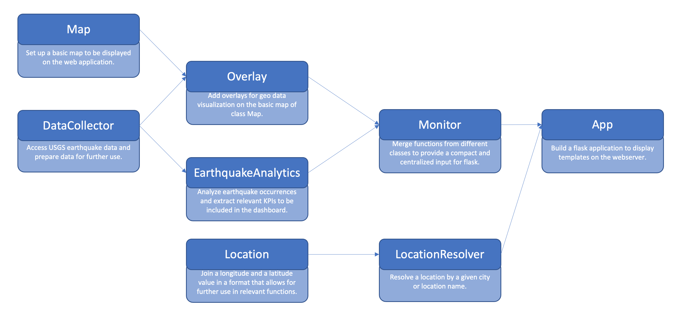

- Alicia Hamann [741182]
- Karina Hasler [738211]
- Gabriel Sacher [862446]
- Thomas Zeutschler 
___
# 001 - Earthquake Detector
### *Realtime detection and visualization of earthquake occurrences in predefined region (map segment) over a certain time.*
___
# Table of content
- [1. Goals](#1-goals)
- [2. Description](#2-description-)
  * [2.1. Processing of real-time data](#21-processing-of-real-time-data)
  * [2.2 Geo data calculations](#22-geo-data-calculations)
  * [2.3 Geo data visualization with OpenStreetMaps](#23-geo-data-visualization-with-openstreetmaps)
  * [2.4 Web frontend development & web-service backend development](#24-web-frontend-development---web-service-backend-development)
  * [2.5 Searchbar for different user defined configurations](#25-searchbar-for-different-user-defined-configurations)
- [3. Methodological approach - Teams Data Science Process](#3-methodological-approach---teams-data-science-process)
- [4. Details of the approach](#4-details-of-the-approach)
- [5. Details of the work](#5-details-of-the-work-)
  * [5.1 Processing of real-time data](#51-processing-of-real-time-data)
  * [5.2 Geo data calculations](#52-geo-data-calculations)
  * [5.3 Geo data visualization with OpenStreetMaps](#53-geo-data-visualization-with-openstreetmaps)
  * [5.4 Web frontend development & Web-service backend development](#54-web-frontend-development---web-service-backend-development)
  * [5.5 Searchbar for different user defined configurations](#55-searchbar-for-different-user-defined-configurations)
- [6. Class Definition](#6-class-definition--)
  * [6.1 DataCollector](#61-datacollector)
  * [6.2 Map](#62-map)
  * [6.3 Overlay](#63-overlay)
  * [6.4 EarthquakeAnalytics](#64-earthquakeanalytics)
  * [6.5 Location](#65-location)
  * [6.6 LocationResolver](#66-locationresolver)
  * [6.7 Monitor](#67-monitor)
  * [6.8 App](#68-app)
  * [6.9 Class Architecture](#69-class-architecture)
- [7. Summary](#7-summary)
- [8. Future Development](#8-future-development)
___

## 1. Goals

- **What was the task to be accomplished?**
  - Realtime detection and visualization of earthquake occurrences within the last 24 hours in predefined region

- **What was intended to achieve?**
  - Provide an intuitive and user-friendly tool for the visualization of earthquakes all over the world
  
## 2. Description
Description and your understanding of the business question or problem, analytical question and/or technical problem associated with the use case.

**What are the challenges that need to be mastered?**

- ### 2.1. Processing of real-time data
  - Find suitable database with detailed, consistent & real-time earthquake data for the entire world
  - Set up an API for the automatic download of data
  - Data preparation : extract relevant data & transform it into a usable structure
  
- ### 2.2 Geo data calculations
  - Calculate the distance from current location to selected earthquake
  
- ### 2.3 Geo data visualization with OpenStreetMaps
  - Visualize the earthquakes on a map
      
        - Adapt circle radius and color depending on the magnitude
        - Show the current location on a map
        - Popup with timestamp, magnitude and distance

- ### 2.4 Web frontend development & web-service backend development
  - Starts a web server, opens a web page in the default browser that provides the following features:
    
        - A nice logo and layout. Use the HSD logo or create your own. 
        - A Google-like search field at the top with a search button to update the visualization. The field should be prefilled with the current location. Pressing the search button will read the location from the search field and refresh the page.
        - Below the search field a screen-filling map is shown with the selected location in the center, and a zoom-in factor appropriate to cover a circle with actual search radius.
        - On overlay that draws the location of all earthquakes of the last 24 hours into the actual map, represented by a circle contains the strength (Richter scala) of the earth quake and a label with the timestamp of the earth quake.
          the web page should be update evers
  
- ### 2.5 Searchbar for different user defined configurations 
  - Three arguments for configuration:

        - A location either as an address or a city, region or country name or longitude and latitude positioning (default value: Current location of the computer)
        - A radius for the radius around the location in kilometers (default value: 250km)
        - An update frequency in seconds (default 30 sec)
    
  - Samples for valid calls:

        - quakemonitor.py
        - quakemonitor.py --location "Paris"
        - quakemonitor.py --location "Silicon Valley" --radius 500  
        - quakemonitor.py --location "Düsseldorf" --radius 100 --update 10
        - quakemonitor.py --long 51.246839 --lat 6.7916647 --radius 100
___

## 3. Methodological approach - Teams Data Science Process

The methodological approach chosen to process and implement the use case.
For analytical uses cases it is wise to follow a structured approach like Microsoft's Team Database Science Process (TDSP), which is the legitimate successor of the CrispDM methodology.
Team Data Science Process (TDSP) is an agile, iterative, data science methodology to improve collaboration and team learning. It is supported through a lifecycle definition, standard project structure, artifact templates, and tools for productive data science.

**Key Components of the TDSP:**
1. **Data Science lifecycle definition**
    - Business Understanding
    - Data Acquisition and Understanding (Data Source, Pipeline, Exploration and Cleaning)
    - Modeling (Feature Engineering: Feature selection, Transforming and Binding)
    - Deployment (Performance, Monitoring)
2. **Standardized project structure**
    - Template for folder structure 
   
      - This is the general project directory structure for Team Data Science Process developed by Microsoft. 
      - It also contains templates for various documents that are recommended as part of executing a data science project when using TDSP.
3. **Infrastructure  and resources recommended for the project**
4. **Tools and utilities recommended for project execution**
___

## 4. Details of the approach

As we mentioned earlier, we followed the Team Database Science Process (TDSP). 
Therefore we created a project management board to ensure a structured approach 
to process and implement our Earthquake-Monitor project:

## 5. Details of the work
### 5.1 Processing of real-time data
- In order to develop a real-time updating map, we needed to included an API from the United States 
       Geological Surves (USGS) website.
- The API delivers our data, which contains all Earthquakes all over the world which took place in the last 24 hours.  
  
    > If you want to get further information about the USGS, click here:
        https://www.usgs.gov/
  > 
  > If you want to take a look at the data of the API, click here: 
        https://earthquake.usgs.gov/earthquakes/feed/v1.0/summary/all_day.geojson
- Data Preparation:
  
    For Data Preparation, we extract relevant data from the USGS API & transform it into a usable structure.
    The relevant data contains different features,which are represented in the table below:
  
    | Earthquake ID |  Longitude  | Latitude | Time | Magnitude |   
    | ---:| ---: | ---: | ---: | ---:
    | 00811746 | -119.4843 | 38.5368,1 | 1625824908214 | 2,0
    | ... | ... | ... | ... | ...

### 5.2 Geo data calculations
  
- With the help of the location (longitude & latitude) of each earthquake and the current or inserted location from the user,
    we were able to append some geo data calculations:
  > ***Filter radius:***
  > With this method, we can only show earthquaked wich are in the given/inserted radius of the user. 
  > If the user does not filter by the radius, we set a default value of ???
  > 
  > ***Distance:***
  > With this method, we can calculate the distance between the given location of the user and each earthquake in kilometer
  >
  > ***Number of earthquakes:***
  > With this method, we can count the number of earthquakes in the given radius and represent the amount of earthquakes on our website
  > 
  > ***Closest Earthquake***
  > Whit this method, we can represent the closed earthquake to the user on our website.

### 5.3 Geo data visualization with OpenStreetMaps
- We created a map with the folium package, to visualize the earthquakes and someother cool features and add-ons.
    > 
    > ***Earthquake Overlay:***
    > - This overlay adds the earthquakes from the API to the folium map and represents them though circles in different sizes and colours, depending on the magnitude of each earthquake.
    > - It sets a marker to the current location of the user as default or to the inserted location of the user.
    > - It also draws a line from the current location to the earthquakes in the radius, to make it  user friendlier to find the nearest earthquakes.
    > - If the user hovers over a earthquake, some detailled information about the earthquake, like timestamp, magnitude and distance pop up.

    > ***Tectonic Overlay:***
    > - This overlay adds the tectonic plates to the map. The user can enable or disable the tectonic plates by ticking or unticking the box in the layer control     > on the top right of the map.
  
### 5.4 Web frontend development & Web-service backend development
- To setup a interactive and intuitive website, we used the flask package. See 6.8 for details on how flask works.
- In total, our website consists of the following three html pages:
1. Home - index.html
2. About Us - about_us.html
3. Website Manual - manual.html

    > 
    > ***1. Index.html***
    > - The index.html file represents our home page and is the core part of our website.
    > - On this page, the earthquake detector is located with all its features.
    > - Also, the map showing the earthquakes within the specified radius of the chosen location is integrated on this page.
    >
    > **Challenge:**
    > - We had some issues to integrate the map into our website as a new map html file was generated every time the code run. We hence had to find a solution that allowed for the integrated file to be dynamic .
    > 
    > **Tips & Tricks:**
    > - We solved the above mentioned issue by using an iframe to integrate the map html file. In general, iframes are used to display content from another source, such as videos or advertisements via hyperlink or html reference in our case.
  
    >
    > ***2. about_us.html***
    > - The about_us.html file represents our about us page that can be reached via our navigation bar.
    > - On this page, the team is introduced as well as their responsibilities within the project.
    > - For each team member, the respective Github account is linked.
    > - By clicking on the button "Jump to Earthquake Detector" the user is redirected to the home page.   
    >
    > **Challenge:**
    > - We wanted a nice looking layout without spending too much time on it.
    > 
    > **Tips & Tricks:**
    > - The internet is full of great open source html templates for all kind of purposes. Especially for common sites such as about us pages there are numerous creative templates available. 
    > - We recommend to use bootstrap for building html website content. Bootstrap offers example code for all kinds of content elements and is relatively easy to implement and work with.
    > - Check out https://getbootstrap.com/docs/5.1/getting-started/introduction/ 

    >
    > ***3. manual.html***
    > - The manual.html file represents our website user manual that can be reached via our navigation bar.
    > - On this page, we explain the main features of the earthquake detector and how it is intended to be used.
    > - Screenshots are used for reference.
    >
    > **Challenge:**
    > - We wanted the boxes (in bootstrap called cards) to be of the same seize in terms of weight and height despite the different text lengths.
    > 
    > **Tips & Tricks:**
    > - Bootstrap makes layouting in html quite easy as it doesn't require you to create a separate css stylesheet. 
    > - Style attributes are added right into the class description.
    > - For the cards to have the same size, you have to add "d-flex" and "flex-column" to the class card-body -> class="card-body d-flex flex-column"

### 5.5 Searchbar for different user defined configurations
- In Order to make our website even more interactive and advanced, we included input fields that determine the search parameter.
    > **Location:**
    > - Default: Current location based on user's IP address
    > - Input: City name, coordinates, or specific address
    > - Output: Map zooms in to chosen location and shows earthquakes that occurred within in the last 24 hours within the specified radius. 
    
    > **Radius**
    > - Default: 250 km
    > - Input: Value from range (min: 100; max:1000; step:50)
    > - Output: Map shows earthquakes that occurred within in the last 24 hours within this radius of the chosen location.
    
    > **Radius**
    > - Default: 1000 seconds
    > - Input: Value from range (min: 10; max:1000; step:10)
    > - Output: Page reloads automatically after the defined time has passed.

## 6. Class Definition

### 6.1 DataCollector
- **Purpose**: Access USGS earthquake data and prepare data for further use.
- **Requirements**:
    - *datetime*: Process earthquake timestamp.
    - *geopy.distance*: Calculate distance between the user’s location and the individual earthquakes.
    - *requests*: Set up API to access USGS earthquake data of the last 24 hours (all earth-quakes regardless of magnitude. This presetting can effortlessly be changed by se-lecting another GeoJSON summary format at the USGS website: https://earthquake.usgs.gov/earthquakes/feed/v1.0/geojson.php).
    - *geocoder*: Access the user’s current location.
- **Functions**:

| Function | Input parameters | Description | Return |
| ---------------|----------------|---------------|----------------|
| __init__ | **lat** (default = 0), **long** (default = 0) | Uses the user’s current location if no values for longitude and latitude are provided for further data preparation. | - |
| load_data | - | Accesses USGS earthquake data and transfers response to *earthquakes* variable. | - |
| prep_data | - | Loads data with *load_data* function. Extracts relevant earthquake features (id, longitude, latitude, place, time, magnitude) and transfer data to an individual dictionary per earthquake. After that appends earthquake dictionaries to *earthquake_data* list. | earthquake_data |
| filter_radius | **location** (default = None), **user_provided_radius** (default = 250) | Prepares data with *prep_data* function. Uses the user’s current location if no specific location is provided. Calculates the distance between this location and every earthquake in *earthquake_data* list and adds the distance (in km) to the earthquake’s dictionary in *earthquake_data* list. If the calculated distance is smaller than the radius provided by the user, the earthquake is added to *earthquake_data_clean* list. | earthquake_data_clean |

### 6.2 Map
- **Purpose**: Set up a basic map to be displayed on the web application.
- **Requirements**:
    - *request*: Access the radius provided by the user on the web application for dynamic zoom-in factor.
    - *folium*: Visualize data on interactive map and add features.
    - *geocoder*: Access the user’s current location.
- **Functions**:

| Function | Input parameters | Description | Return |
| ---------------|----------------|---------------|----------------|
| __init__ | **lat** (default = 0), **long** (default = 0) | Uses the user’s current location if no values for longitude and latitude are provided for further data preparation. | - |
| set_up_map | **location** (default = None) | Set up a folium map that is centered at the user provided location, highlighted by a marker. By default, the map is centered at the user’s current location. The zoom-in factor adjust dynamically depending on the user provided radius (default = 250 km). OpenStreetMap was chosen as the default layout. | - |
| save_map | **file_name** | Saves the map with the provided file name. | - |

### 6.3 Overlay
- **Purpose**: Add overlays for geo data visualization on the basic map of class Map.
- **Requirements**:
    - *folium*: Visualize data on interactive map and add features.
    - *folium.Features DivIcon*: Show magnitude markers on the map.
    - *folium.Plugins HeatMap*: Implement a heatmap of earthquake occurrences within the last 24 hours.
    - *branca.colormap*: Dynamically adjust the circle marker’s size according to the earthquake’s magnitude.
    - *geocoder*: Access the user’s current location.
- **Functions**:

| Function | Input parameters | Description | Return |
| ---------------|----------------|---------------|----------------|
| __init__ | **lat** (default = 0), **long** (default = 0) | Uses the user’s current location if no values for longitude and latitude are provided for further data preparation. | - |

- Includes superclass Overlay and subclasses EarthquakeOverlay and TectonicOverlay that inherit from class Overlay.
- **Functions - Class EarthquakeOverlay**:

| Function | Input parameters | Description | Return |
| ---------------|----------------|---------------|----------------|
| __init__ | **earthquake_data_clean** | Inherit __init__ configurations from superclass Overlay and initialize *earthquake_data_clean* variable. | - |
| apply_circle_markers | **map** | Adds a circle marker for every earthquake in earthquake_data_clean to the map. The circle markers are added to the map as a feature group that allows the user to show or hide the circle markers via layer control. By default, the circle markers are shown on the map. The circle marker’s size and color are dynamically adjusted according to the earthquake’s magnitude. By hovering over the circle marker, the user gets information about the earthquake’s time and magnitude. | - |
| apply_magnitude_markers | **map** | Adds a magnitude marker for every earthquake in earthquake_data_clean to the map. The magnitude markers are added to the map as a feature group that allows the user to show or hide the magnitude markers via layer control. By default, the magnitude markers are shown on the map. | - |
| apply_connective_lines | **map**, **location** (default = None) | Adds a connective line between every earthquake in *earthquake_data_clean* and the user provided location to the map. The connective line are added to the map as a feature group that allows the user to show or hide the connective line via layer control. By default, the connective lines are shown on the map. | - |
| apply_heatmap | **map** | Adds a heatmap of the earthquake occurrence of the last 24 hours within the user provided radius of the user provided location. The heatmap can be shown or hidden via layer control. By default, the heatmap is not shown on the map. | - |

- **Functions - Class TectonicOverlay**:

| Function | Input parameters | Description | Return |
| ---------------|----------------|---------------|----------------|
| apply_overlay | **map** | Adds the tectonic plates to the map. The tectonic plates can be shown or hidden via layer control. By default, the tectonic plates are shown on the map. | - |
| add_to_layer_control | **map** | Adds layer control functionality in the top right corner of the map. | - |

### 6.4 EarthquakeAnalytics
- **Purpose**: Analyse earthquake occurrences and extract relevant KPIs to be included in the dashboard.
- **Requirements**: -
- **Functions**:

| Function | Input parameters | Description | Return |
| ---------------|----------------|---------------|----------------|
| __init__ | **earthquake_data**, **earthquake_data_clean** | Initialize *earthquake_data* and *earthquake_data_clean* variables. | - |
| get_total_filtered_earthquakes | **location** (default = None), **radius** (default = 250) | Calculate the number of total earthquake occurrences of the last 24 hours within the user provided radius of the user provided location. | total_filtered_earthquakes |
| get_filtered_minor_earthquakes | **location** (default = None), **radius** (default = 250) | Calculate the number of minor earthquake occurrences of the last 24 hours within the user provided radius of the user provided location. In our case, a minor earthquake is defined as an earthquake with a magnitude below or of 2.5. | filtered_minor_earthquakes |
| get_filtered_moderate_earthquakes | **location** (default = None), **radius** (default = 250) | Calculate the number of moderate earthquake occurrences of the last 24 hours within the user provided radius of the user provided location. In our case, a moderate earthquake is defined as an earthquake with a magnitude between 2.5 and 6.0. | filtered_moderate_earthquakes |
| get_filtered_strong_earthquakes | **location** (default = None), **radius** (default = 250) | Calculate the number of strong earthquake occurrences of the last 24 hours within the user provided radius of the user provided location. In our case, a strong earthquake is defined as an earthquake with a magnitude above 6.0. | filtered_strong_earthquakes |
| get_closest_filtered_earthquake | **location** (default = None), **radius** (default = 250) | Calculate the distance (in km) between the user provided location and the closest earthquake of the last 24 hours. | closest_filtered_earthquake |
| get_place_of_closest_filtered_earthquake | **location** (default = None), **radius** (default = 250) | Get the place of the closest earthquake of the last 24 hours within the user provided radius of the user provided location. The place information is included in the USGS API. | place_of_closest_filtered_earthquake |
| get_strongest_filtered_earthquake | **location** (default = None), **radius** (default = 250) | Get the highest magnitude of all earthquakes of the last 24 hours within the user provided radius of the user provided location. | strongest_filtered_earthquake |
| get_total_earthquakes_worldwide | - | Calculate the number of total earthquake occurrences worldwide of the last 24 hours. | total_earthquakes_worldwide |
| get_minor_earthquakes_worldwide | - | Calculate the number of minor earthquake occurrences worldwide of the last 24 hours. In our case, a minor earthquake is defined as an earthquake with a magnitude below or of 2.5. | minor_earthquakes_worldwide |
| get_moderate_earthquakes_worldwide | - | Calculate the number of moderate earthquake occurrences worldwide of the last 24 hours. In our case, a moderate earthquake is defined as an earthquake with a magnitude between 2.5 and 6.0. | moderate_earthquakes_worldwide |
| get_strong_earthquakes_worldwide | - | Calculate the number of strong earthquake occurrences worldwide of the last 24 hours. In our case, a strong earthquake is defined as an earthquake with a magnitude above 6.0. | strong_earthquakes_worldwide |
| get_strongest_earthquake_worldwide | - | Get the highest magnitude of all earthquakes of the last 24 hours worldwide. | strongest_earthquake_worldwide |
| get_place_of_strongest_earthquake_worldwide | - | Get the place of the strongest earthquake of the last 24 hours worldwide. The place information is included in the USGS API. | place_of_strongest_earthquake_worldwide |

### 6.5 Location
- **Purpose**: Join a longitude and a latitude value in a format that allows for further use in relevant functions.
- **Requirements**: -
- **Functions**: -

### 6.6 LocationResolver
- **Purpose**: Resolve a location by a given city or location name.
- **Requirements**:
  - *geocoder*: Access the user’s current location.
  - *geopy.geocoders Nomatim*: Transform longitude and latitude values in address names and vice versa.
- **Functions**:

| Function | Input parameters | Description | Return |
| ---------------|----------------|---------------|----------------|
| __init__ | **address** (default = empty string) | Takes the user provided address as an argument. If no user address is provided, takes the user’s current location as an argument. | - |
| get_current_location | - | Accesses the user’s current IP address and extracts longitude and latitude values. These longitude and latitude values are then transformed in address names. | current_location |

### 6.7 Monitor 
- **Purpose**: Merge functions from different classes to provide a compact and centralized input for flask.
- **Requirements**:
  - *geopy.geocoders Nomatim*: Transform longitude and latitude values in address names and vice versa.
- **Functions**:

| Function | Input parameters | Description | Return |
| ---------------|----------------|---------------|----------------|
| collect_default_data | - | Sets up a DataCollector object and applys the *filter_radius* function. | - |
| relocate | **location** (default = None), **coordinates** (default = None), **radius** (default = 250) | Applies the filter_radius function according to a user provided address. If a string with a location is provided, this location is transformed into longitude and latitude values before applying the filter_radius function. If coordinates are provided, the filter_radius function is applied with these coordinates. | earthquake_data_clean |
| build_map | **location** (default = None), **coordinates** (default = None), **radius** (default = None) | Builds a map to be displayed on the web application. If neither a location nor coordinates are provided (default when webserver is started), the map is built around the user’s current location. If either a location or coordinates are provided (manually entered by the user is the search field), the map is built around this address. In both cases, a base map is built and features (circle markers, magnitude markers, connective lines, a heatmap, tectonic plates and layer control) are added to the map. | map |
| perform_earthquake_analytics | **location** (default = None), **radius** (default = None) | Sets up a DataCollector object and performs all functions of class EarthquakeAnalytics. | total_filtered, minor_filtered, moderate_filtered, strong_filtered, closest_filtered, place_of_closest_filtered, strongest_filtered, total_worldwide, minor_worldwide, moderate_worldwide, strong_worldwide, strongest_worldwide, place_of_strongest_worldwide |

### 6.8 App
- **Purpose**: Build a flask application to display templates on the webserver.
- **Requirements**:
  - *os*: Save map html file in templates directory.
  - *flask Flask*: Build a flask application.
  - *flask render_template*: Render html templates on the webserver.
  - *flask request*: Access user provided information (location, radius, update frequency) to adapt map html file.
- **app_routes**:
    - */*: Render index.html with customized map and bootstrapped web application layout.
    - *map*: Render map.html to include map on web application.
    - *manual*: Render manual.html to include a website manual.
    - *about_us*: Render about_us.html to include About Us page on web application.

### 6.9 Class Architecture

___
## 7. Summary 
A summary if the targets have been achieved, and if not - and whatever the reason is - why it wasn't achieved.
    
- 7.1 Findings
- 7.2.Achievements
- 7.3 User Manual
___ 
## 8. Future Development
What are the next steps that could be done in order to keep process in the project.

- Forecase 
- Create mobile app
